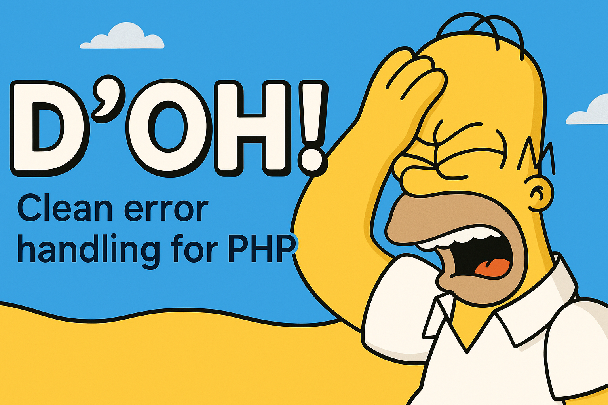
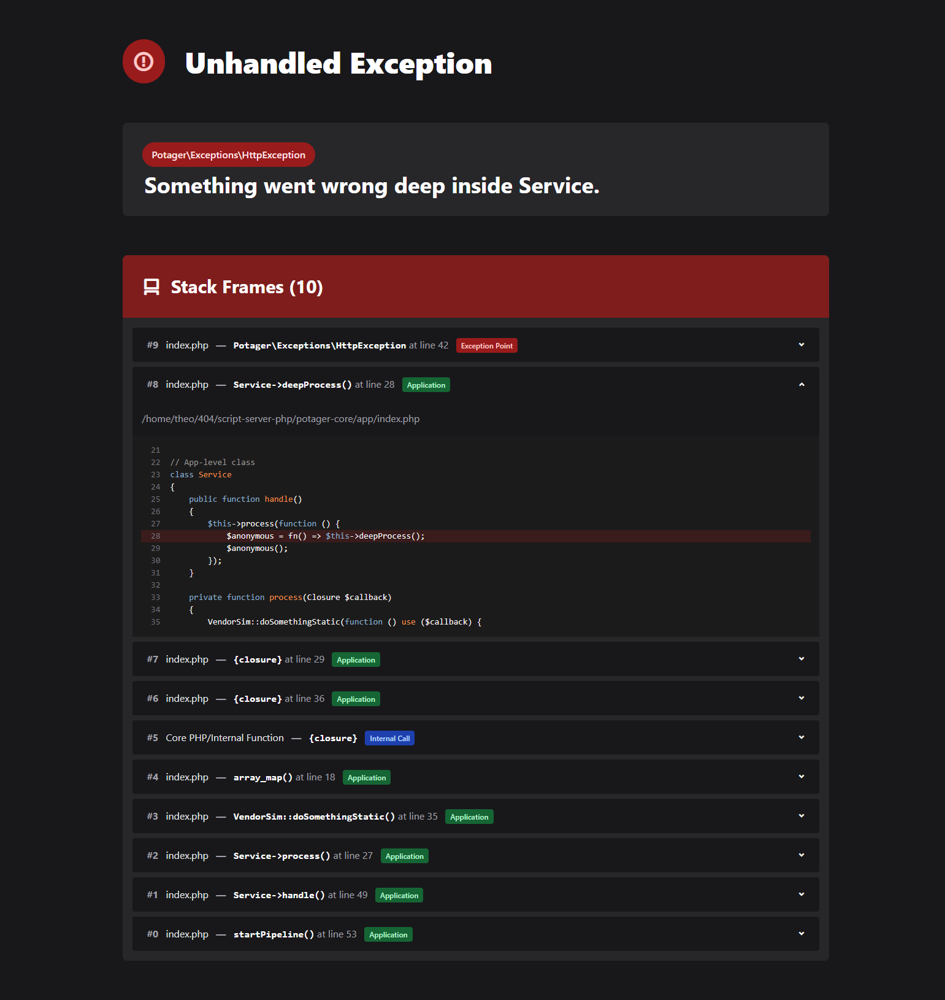

<p align="center">
  
</p>

<h1 align="center">D'oh! — PHP Throwable Formatter</h1>

<p align="center">
  <a href="https://packagist.org/packages/theovdml/doh"></a>
  <a href="https://github.com/theo-vdml/doh-php-error-formatter/releases"></a>
  <a href="https://packagist.org/packages/theovdml/doh"></a>
  <a href="https://packagist.org/packages/theovdml/doh"></a>
</p>

**D'oh!** is a lightweight, flexible PHP library for formatting exceptions and errors (`\Throwable`)  
into various human- and machine-readable formats: HTML, JSON, JSON:API, plain text, and XML.

It simplifies transforming PHP exceptions into structured, beautifully formatted outputs,  
perfect for error pages, API error responses, logs, or CLI tools.

Doh was originally designed as part of the Potager framework to provide elegant throwable formatting.
However, it is fully decoupled and works perfectly as a standalone package in any PHP project.
It’s not as ambitious or feature-rich as libraries like Whoops, and it’s still a work in progress with limited testing.
Use with caution and feel free to contribute!

<p align="center">
  <strong>A delightful PHP Throwable formatter that says:</strong><br/>
  
</p>
<p align="center">
  <em>“D’oh!” — <strong>Homer Simpson</strong>, and now your error pages.</em>
</p>

## Features

✅ Elegant HTML output with syntax-highlighted source snippets  
✅ Structured formats: JSON, JSON:API, Plain Text, and XML  
✅ Standalone & framework-agnostic — plug and play  
✅ Composer-ready, PSR-4 autoloaded  
✅ Ideal for APIs, CLIs, websites, and dev environments

## Requirements

-   PHP 8.1 or higher
-   Highlight.php 9.18 or higher

## Installation

Install via Composer:

```bash
composer require theovdml/doh
```

## Usage

```php
use DohFormatting\Doh\Doh;

try {
    // Some code that throws an exception
    throw new RuntimeException("Something went wrong!");
} catch (\Throwable $e) {
    $formatter = new Doh($e);

    // Get HTML formatted error page (for web display)
    echo $formatter->toHtml();

    // Get JSON for API response or logging
    $json = $formatter->toJson();

    // Get JSON:API compliant error document
    $jsonApi = $formatter->toJsonApi();

    // Plain text (for CLI or logs)
    $text = $formatter->toPlainText();

    // XML error representation
    $xml = $formatter->toXml();
}
```

## 🧪 Example Output (HTML)

Here’s what your exception looks like with `D'oh! → toHtml()`:

<p align="center">
  
</p>

> ✅ Clean layout, clear stack trace, highlighted code snippets — all wrapped in a developer-friendly interface.

## API Documentation

The core of **D'oh!** is the `Doh` class, which wraps a PHP `\Throwable` and provides flexible methods to format it into various output types. Below is a detailed overview of its API:

### `Doh::__construct(\Throwable $throwable)`

Creates a new formatter instance from a throwable (exception or error).

-   **Parameters:**

    -   `\Throwable $throwable` — The exception or error you want to format.

-   **Usage:**

    ```php
    $doh = new Doh($exception);
    ```

### `Doh::buildTrace(): Trace`

Generates a detailed `Trace` object representing the throwable's stack trace.

-   This method:

    -   Prepends a **virtual top frame** corresponding to the exact location where the throwable was thrown (file and line).
    -   Compensates for PHP’s `Exception::getTrace()` behavior, which does not include the throw location itself.
    -   Returns a `Trace` object containing an array of `Frame` objects, each representing a stack frame.

-   **Returns:**
    `Trace` — an iterable collection of `Frame` objects representing the full stack trace, including the throw frame.

-   **Usage example:**

    ```php
    $trace = $doh->buildTrace();
    foreach ($trace as $frame) {
        echo $frame->getContext() . ' in ' . $frame->getFileLabel() . PHP_EOL;
    }
    ```

### `Doh::getThrowable(): \Throwable`

Returns the original throwable instance wrapped by this formatter.

-   **Returns:**
    `\Throwable`

-   **Usage example:**

    ```php
    $exception = $doh->getThrowable();
    ```

### `Doh::getClass(): string`

Returns the fully qualified class name of the throwable.

-   **Returns:**
    `string` — e.g. `"RuntimeException"`

-   **Usage example:**

    ```php
    echo $doh->getClass();  // Outputs: RuntimeException
    ```

### `Doh::getMessage(): string`

Returns the throwable's error message.

-   **Returns:**
    `string`

-   **Usage example:**

    ```php
    echo $doh->getMessage();  // Outputs: Something went wrong!
    ```

## Formatters

Each formatter returns a string in a specific format representing the throwable and its trace.

### `Doh::toHtml(): string`

-   Produces a full **HTML error page** designed for developer-friendly display in browsers.
-   Features:

    -   Syntax-highlighted source code snippets around each frame.
    -   Clear, styled stack trace.
    -   File and line info with links or tooltips (if enabled).

-   **Use case:** Custom error pages for web applications during development.

### `Doh::toJson(): string`

-   Outputs a structured **JSON string** containing:

    -   Throwable class, message, and code.
    -   Full stack trace as an array of frames.

-   **Use case:** API error responses or structured logging systems.

### `Doh::toJsonApi(): string`

-   Returns a **JSON\:API-compliant** error document following [JSON\:API specification](https://jsonapi.org/format/#errors).
-   Includes:

    -   Standardized keys like `status`, `code`, `title`, and detailed trace metadata.

-   **Use case:** APIs adhering to JSON\:API spec for error reporting.

### `Doh::toPlainText(): string`

-   Provides a **plain-text** formatted output of the error and its trace.
-   Includes file, line, function, and message details.
-   **Use case:** CLI tools, console logs, or environments without rich formatting.

### `Doh::toXml(): string`

-   Returns a **well-formed XML document** describing the throwable and its stack trace.
-   Structure includes:

    -   Root error element with code, message, file, and line.
    -   Nested trace frames.

-   **Use case:** Systems consuming XML error reports, legacy integrations, or logs requiring XML.

## Advanced Usage: Working with `Trace` and `Frame`

While **D'oh!** is designed for straightforward formatting of exceptions, its core components — **Trace** and **Frame** — provide powerful abstractions for working with stack traces at a granular level. These classes let you analyze, filter, and manipulate error stack traces for custom logging, debugging, or error reporting.

### `DohFormatting\Doh\Exception\Trace`

The `Trace` class represents the full stack trace of an exception, including a special _virtual frame_ that points exactly to where the throwable was thrown. It acts as a container of `Frame` instances, each representing one step in the call stack.

#### Key Features and Methods

-   **Iterable Collection**
    Implements `IteratorAggregate`, so you can loop over all frames:

    ```php
    foreach ($trace as $frame) {
        echo $frame->getContext() . PHP_EOL;
    }
    ```

-   **Frame Access and Manipulation**

    -   `append(Frame $frame)`: Add a frame at the end.
    -   `prepend(Frame $frame)`: Add a frame at the beginning (used internally for the virtual throw frame).
    -   `all()`: Get all frames as an array.

-   **Filtering and Selection**

    -   `mostRelevant()`: Returns the most relevant frame for debugging, prioritizing application code over vendor or internal frames.
    -   `onlyApp()`: Returns only frames that originate from your app’s codebase (excludes vendor/internal frames).

-   **Conversion Utilities**

    -   `toArray()`: Converts all frames to an array of plain data, useful for custom serialization or further inspection.
    -   `fromBacktrace(array $backtrace, array $virtualFrames = [])`: Static factory to create a `Trace` instance from a raw PHP debug backtrace plus optional virtual frames (like the throw site).

#### Example: Filtering for App Frames

```php
$trace = $doh->buildTrace();
$appFrames = $trace->onlyApp();

foreach ($appFrames as $frame) {
    echo $frame->getFileLabel() . ':' . $frame->line . ' - ' . $frame->getContext() . PHP_EOL;
}
```

### `DohFormatting\Doh\Exception\Frame`

Each `Frame` object represents one call in the stack trace with detailed information about the file, line, function, class, and call type.

#### Properties

-   `?string $file` — File path where the frame occurred.
-   `?int $line` — Line number in the file.
-   `string $function` — Function name (or special markers like `{main}`, `{closure}`).
-   `string $class` — Class name if applicable.
-   `string $type` — Call type: `->` for instance methods or `::` for static calls.
-   `array $args` — Arguments passed to the function (can be useful for deeper inspection).

#### Useful Methods

-   **Context and Location**

    -   `getContext()`: Returns a human-readable string describing the call context, e.g. `"MyClass->myMethod()"` or `"myFunction()"`.
    -   `getFileLabel()`: Returns the base filename or `"Core PHP/Internal Function"` if no file info is available.
    -   `getFilePath()`: Full file path or empty string.
    -   `getLineText()`: Returns a text snippet like `"at line 42"`.

-   **Source Code Excerpts**

    -   `getExcerpt(int $padding = 7)`: Returns a snippet of source code around the frame’s line (7 lines before and after by default). Returns `null` if the file is unavailable or unreadable. This is great for displaying context in error pages or logs.

-   **Frame Classification**

    -   `isInternal()`: True if the frame is an internal PHP function (no file info).
    -   `isApp()`: True if the frame belongs to the application (non-vendor, non-internal).
    -   `isVendor()`: True if the frame belongs to a vendor package (`/vendor/` in path).

#### Creating a Frame

Frames are usually created internally from backtrace arrays using:

```php
$frame = Frame::fromArray([
    'file' => '/path/to/file.php',
    'line' => 123,
    'function' => 'myFunction',
    'class' => 'MyClass',
    'type' => '->',
    'args' => ['foo', 'bar'],
]);
```

#### Example: Displaying Frame Information

```php
foreach ($trace as $frame) {
    echo $frame->getFileLabel() . ':' . $frame->line . PHP_EOL;
    echo 'Called: ' . $frame->getContext() . PHP_EOL;
    echo $frame->getExcerpt(3) ?: '[No source available]' . PHP_EOL;
}
```

## License

MIT License © theo_vdml

## Contributing

Feel free to submit issues or pull requests on GitHub.
Please include tests and documentation for any new features.

## Acknowledgments

D’oh! uses [scrivo/highlight.php](https://github.com/scrivo/highlight.php) for source code syntax highlighting.
Thanks to the open-source community for all the great tools.
